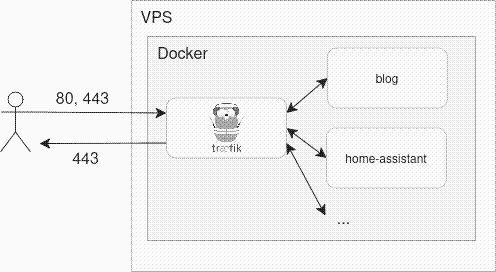

# Astro image dithering plugin


## Why?

Want even quicker image loading times combined with a lower carbon footprint of serving your images? Use this plugin to dither your images before serving them to your audience! This decreases the image size dramatically whilst still providing your audience the context needed for your articles.

For example:


This image above is 29.07 kb.



The dithered image above is 3.43 kb

A reduction of more than 8 times the initial size of the image without loss of context to the reader. The black and white palette is not that appealing, so the integration will provide a client-side filter using css which allows you to style the image to your theme like so:


See the [css-file](./packages/dither-images/dither-image-toggle.css) and the `.dithered` class.

For more information about filter's hue-rotate property, [read up on the documentation on mozilla.org](https://developer.mozilla.org/en-US/docs/Web/CSS/filter-function/hue-rotate). Find your color to use which matches your theme using [this handy page](https://web.archive.org/web/20160219005748/https://dl.dropboxusercontent.com/u/3260327/angular/CSS3ImageManipulation.html).

## Limitations

The current bayer dithering algorithm does not use the alpha channel of the png's provided. This causes transparent PNG's to look incorrect. A workaround is to only provide images with a solid color background (eg. white or black or any other color).

## Guide

The astro integration can be used like this in your astro.config.mjs:

```js
import { ditherImagesIntegration } from "@bashbers/astro-image-dithering";

export default defineConfig({
  integrations: [ditherImagesIntegration(
    {
      directoryToTraverse?: string; // Provide directory in which the plugin should search for images and dither them. By default looks inside your whole project.
      injectCss?: boolean; // Injects css which styles the figure, img and button for the images
      injectClientsideJs?: boolean; // Injects js which toggles the img between dithered and non-dithered
    }
  )],
});
```

## How does it work?

The Astro integration will traverse your Astro directory searching for PNG files and convert them to dithered images using the -dithered.png suffix. They will be stored next to the original images. The dithering is done using a Bayer Dithering algorithm [here](./packages/dither-images/lib.ts). Inspiration is obtained from https://solar.lowtechmagazine.com/.

To make the integration work, it will provide a rehype container which replaces the  with the corresponding figure, img and button for the dithered image. The source can be found [here](./packages/dither-images/rehypeDitheredImageContainerHtml.ts); The rehype plugin which will convert your existing image inclusions in your .md files to a figure containing both the image and a toggle to switch between the dithered and non-dithered version.

It will also by default inject css and js in your pages. The injected css is very slim and readable (if you ask me) and can be referenced in the [css-file](./packages/dither-images/dither-image-toggle.css) and the [js-file](./packages/dither-images/dithered-image-container.ts) The js file is a client-side script which will allow toggling between the dithered and non-dithered version of the image inside the container.

## Custom css

If you want to apply custom css to the container, please set injectCss to false in the options of the integration and provide your own css file which applies styles to:

- .dithered
- .dithered-image-container
- .dithered-button
- .dithered-label

## Future ideas

- Expand image types to jpg, jpeg etc.
- Support transparent PNGs
- Support images next to markdown files.
